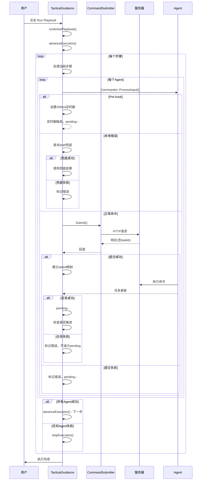

# Tactical Guidance 工作流执行引擎逻辑图

## 概述

Tactical Guidance 模块的工作流执行引擎是一个严格的串行执行系统，确保只有当所有 Agent 的任务状态为 "Success" 时才继续执行下一步。

## 核心状态变量

```cpp
// 执行状态
bool executionRunning;                          // 是否正在执行
bool executionAdvanceScheduled;                 // 是否已调度推进执行
QTreeWidgetItem* currentExecutingItem;          // 当前执行的步骤

// 队列和映射
QList<QTreeWidgetItem*> executionQueue;         // 待执行的步骤队列
QStringList executionTargetAgents;              // 目标 Agent 列表

// 计数和错误跟踪
QMap<QString, int> composerItemPendingCount;    // 每个步骤的待完成任务数
QMap<QString, bool> composerItemHasError;       // 每个步骤/Agent的错误状态
QMap<QString, QTreeWidgetItem*> taskIdToComposerItem;  // TaskId 到步骤的映射
QMap<QString, QTreeWidgetItem*> resultsStepItems;      // 结果树中的步骤项
QMap<QString, QTreeWidgetItem*> resultsAgentItems;     // 结果树中的 Agent 项
```

## 执行流程图

```mermaid
graph TD
    A[用户点击 Run Playbook] --> B[runActivePlaybook]
    B --> C{检查前置条件}
    C -->|executionRunning=true| D[直接返回]
    C -->|未选择Agent| E[弹窗提示]
    C -->|无命令步骤| F[弹窗提示]
    C -->|通过检查| G[初始化执行状态]
    
    G --> H[清空所有状态变量]
    H --> I[构建 executionQueue]
    I --> J[初始化 resultsTree]
    J --> K[executionRunning = true]
    K --> L[调用 advanceExecution]
    
    L --> M{executionRunning?}
    M -->|false| N[返回]
    M -->|true| O{有 currentExecutingItem?}
    
    O -->|false| P[从 executionQueue 获取下一个步骤]
    P --> Q{获取到步骤?}
    Q -->|false| R[调用 stopExecution]
    Q -->|true| S[设置 currentExecutingItem]
    S --> T[初始化步骤状态]
    T --> U[遍历所有 Agent 提交命令]
    
    O -->|true| V[检查当前步骤完成状态]
    V --> W{pending > 0?}
    W -->|true| X[返回等待]
    W -->|false| Y[检查错误状态]
    Y --> Z{有Agent错误?}
    Z -->|true| AA[停止执行]
    Z -->|false| BB[currentExecutingItem = nullptr]
    BB --> P
    
    U --> CC[处理每个Agent]
    CC --> DD{Agent有效?}
    DD -->|false| EE[标记错误]
    DD -->|true| FF[调用 Commander::ProcessInput]
    
    FF --> GG{是 pre-hook?}
    GG -->|true| HH[设置 200ms 定时器]
    HH --> II[pending++]
    II --> JJ[显示 Hook 状态]
    JJ --> CC
    
    GG -->|false| KK{有本地错误?}
    KK -->|true| LL[尝试 shell 兜底]
    LL --> MM{兜底成功?}
    MM -->|true| NN[使用兜底结果]
    MM -->|false| OO[显示本地错误]
    OO --> CC
    
    KK -->|false| PP[提交命令到服务器]
    PP --> QQ[pending++]
    QQ --> RR[显示 Submitted 状态]
    
    RR --> SS[CommandSubmitter::Submit]
    SS --> TT{提交成功?}
    TT -->|false| UU[标记错误, pending--]
    UU --> VV[调度 advanceExecution]
    VV --> CC
    
    TT -->|true| WW{获取到 taskId?}
    WW -->|false| XX[标记错误, pending--]
    XX --> VV
    WW -->|true| YY[建立 taskId 映射]
    YY --> CC
    
    AA --> ZZ[stopExecution]
    ZZ --> AAA[清空所有状态]
    AAA --> BBB[executionRunning = false]
    
    R --> ZZ
    
    X --> CCC[等待任务更新]
    CCC --> DDD[handleTaskUpdate 被调用]
    DDD --> EEE{task.Completed?}
    EEE -->|false| FFF[更新UI状态]
    FFF --> CCC
    
    EEE -->|true| GGG{task.Status == "Success"?}
    GGG -->|true| HHH[pending--]
    HHH --> III{pending == 0?}
    III -->|true| JJJ[调度 advanceExecution]
    III -->|false| CCC
    
    GGG -->|false| KKK[标记错误]
    KKK --> CCC
```

## 关键函数详细逻辑

### 1. `runActivePlaybook()` - 启动执行

```cpp
void TacticalGuidanceWidget::runActivePlaybook()
{
    // 1. 前置检查
    if (executionRunning) return;                    // 防止重复执行
    if (无选择的Agent) 弹窗提示并返回;
    if (无命令步骤) 弹窗提示并返回;
    
    // 2. 初始化状态
    清空所有状态变量;
    executionQueue = 收集所有命令步骤();
    初始化 resultsTree;
    
    // 3. 开始执行
    executionRunning = true;
    advanceExecution();
}
```

### 2. `advanceExecution()` - 推进执行

```cpp
void TacticalGuidanceWidget::advanceExecution()
{
    // 1. 检查执行状态
    if (!executionRunning) return;
    
    // 2. 处理当前步骤完成
    if (currentExecutingItem) {
        const QString stepInstanceId = currentExecutingItem->data(0, Qt::UserRole).toString();
        const int pending = composerItemPendingCount.value(stepInstanceId, 0);
        
        // 严格等待所有任务成功完成
        if (pending > 0) return;  // 还有未完成的任务
        
        // 检查错误状态
        bool hasError = false;
        for (const QString& agentId : executionTargetAgents) {
            const QString agentErrorKey = stepInstanceId + "|error|" + agentId;
            if (composerItemHasError.value(agentErrorKey, false)) {
                hasError = true;
                break;
            }
        }
        
        // 更新UI状态
        currentExecutingItem->setText(1, hasError ? "Error" : "Success");
        
        // 严格错误处理：任何Agent失败都停止执行
        if (hasError) {
            stopExecution();
            return;
        }
        
        // 清空当前步骤，准备下一步
        currentExecutingItem = nullptr;
    }
    
    // 3. 获取下一个步骤
    while (!executionQueue.isEmpty()) {
        QTreeWidgetItem* next = executionQueue.takeFirst();
        if (next) {
            currentExecutingItem = next;
            break;
        }
    }
    
    // 4. 检查是否执行完毕
    if (!currentExecutingItem) {
        stopExecution();
        return;
    }
    
    // 5. 执行当前步骤
    执行当前步骤的所有Agent命令();
}
```

### 3. `handleTaskUpdate()` - 处理任务更新

```cpp
void TacticalGuidanceWidget::handleTaskUpdate(const TaskData& task)
{
    // 1. 基本检查
    if (!executionRunning) return;
    if (taskId无效或无映射) return;
    
    // 2. 更新UI状态
    更新Agent任务状态和输出;
    
    // 3. 处理任务完成
    if (!task.Completed) return;
    
    // 4. 严格的成功判断
    const QString agentErrorKey = stepInstanceId + "|error|" + task.AgentId;
    if (task.Status != "Success") {
        // 标记Agent错误
        composerItemHasError[agentErrorKey] = true;
        composerItemHasError[stepInstanceId] = true;
        // 注意：不减少pending计数，阻止执行推进
    } else {
        // 只有成功才减少pending计数
        composerItemPendingCount[stepInstanceId]--;
        
        // 检查是否可以推进
        if (pending == 0) {
            调度 advanceExecution();
        }
    }
}
```

### 4. `stopExecution()` - 停止执行

```cpp
void TacticalGuidanceWidget::stopExecution()
{
    // 清空所有执行状态
    executionRunning = false;
    executionAdvanceScheduled = false;
    executionQueue.clear();
    currentExecutingItem = nullptr;
    executionTargetAgents.clear();
    
    // 清空所有映射和计数
    taskIdToComposerItem.clear();
    composerItemPendingCount.clear();
    composerItemHasError.clear();
    resultsStepItems.clear();
    resultsAgentItems.clear();
}
```

## 关键特性

### 1. 严格的串行执行
- 每次只执行一个步骤
- 只有当前步骤完全成功才执行下一步

### 2. 严格的成功判断
- 只有当 `task.Status == "Success"` 时才减少 `pending` 计数
- 任何 Agent 失败都会阻止执行推进

### 3. 每个 Agent 独立跟踪
- 使用 `agentErrorKey = stepInstanceId + "|error|" + agentId` 跟踪每个 Agent 的错误状态
- 一个 Agent 失败不影响其他 Agent 的状态显示

### 4. Pre-hook 非阻塞处理
- Pre-hook 命令通过 200ms 定时器自动完成
- 不影响主要执行流程

### 5. 错误处理机制
- 提交失败、本地错误、任务失败都会被正确标记
- 任何错误都会停止整个执行

## 执行时序图



## 总结

这个执行引擎确保了：
1. **严格的串行执行** - 一次只执行一个步骤
2. **严格的成功判断** - 只有所有 Agent 都成功才继续
3. **独立的状态跟踪** - 每个 Agent 的状态独立管理
4. **完善的错误处理** - 任何错误都会被正确处理和显示
5. **非阻塞的 pre-hook** - pre-hook 不影响主要执行流程
